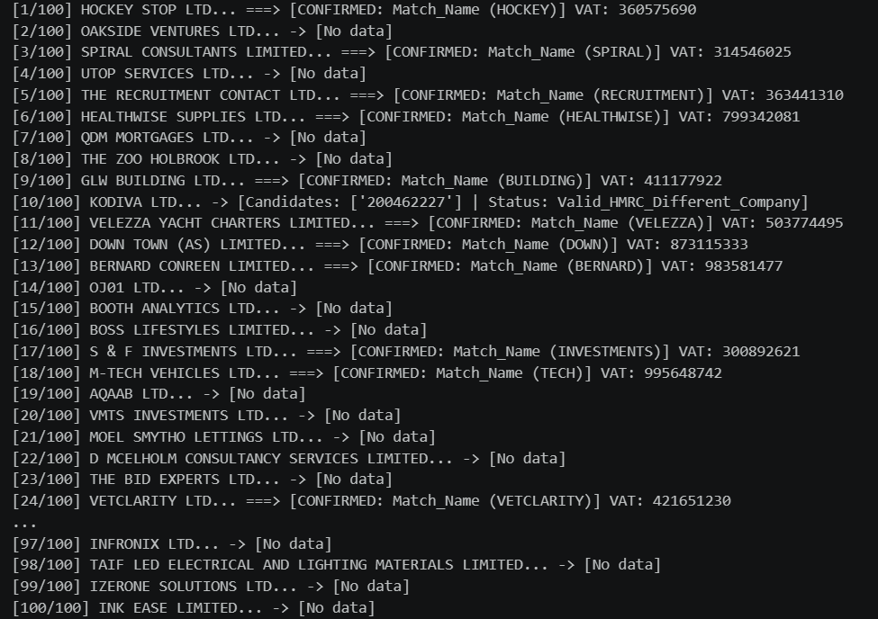

# VAT-Identifier-Discovery

I have always wondered if it is possible to use algorithms in order to search results all over the internet with limited resources. This project confirmed that yes, you can use your laptop at home to do that, but with a lot of resources it can be done way better, and we will see why.

## The problem:
A procurement team at a mid-sized manufacturer has 40,000 UK suppliers and pays invoices against them every month. Matching an invoice to a supplier record reliably needs one thing: the supplier’s VAT registration number, the only identifier that appears on both the invoice and the tax record. They have it for about a third of their suppliers. For the rest they match on company name, so “J Smith Building Services Ltd” and “J. Smith Building Svcs Limited” are two suppliers, or one, and nobody knows which.

We would like to sell them the missing two thirds. Nobody sells it, and there is no dataset to buy.

Your task is to determine whether a UK company VAT dataset can be built from the open web, and to prove it on a sample.

## My initial thoughts

- I downloaded the data from ([Companies House](https://download.companieshouse.gov.uk/en_output.html)) and I looked at the variables. Some of them are:


- `CompanyName`, `CompanyNumber`
- `RegAddress.AddressLine1`, `RegAddress.PostTown`, `RegAddress.PostCode`, `RegAddress.Country`
- `CompanyStatus`, `IncorporationDate`, `URI`

<details>
<summary>Full column list (click to expand)</summary>

```
Index(['CompanyName', 'CompanyNumber', 'RegAddress.CareOf', 'RegAddress.POBox',
       'RegAddress.AddressLine1', 'RegAddress.AddressLine2',
       'RegAddress.PostTown', 'RegAddress.County', 'RegAddress.Country',
       'RegAddress.PostCode', 'CompanyCategory', 'CompanyStatus',
       'CountryOfOrigin', 'DissolutionDate', 'IncorporationDate', ...],
      dtype='str')
```

</details>


- I tried to manually open some of the links of these companies, maybe I could have found any important details or even the VAT, but none of the links worked.
- Then I opened my browser and simply typed "How to find the VAT of a company in UK" (I have never been familiar with it). This led to me finding a lot of sites which could, in theory, give you the VAT if you type in the company number or the company name. The issue is that they either did not have any api, or they are not free. I believe that any work you do, you should search for alternatives in order not to consume lots of resources.

## Sampling
- I could have thought on lots of solutions, but first I needed a sample that I could on work on.
- At this step, there is a variable that I am interested in, which is `CompanyStatus`, with the unique values:

| CompanyStatus                                    |   count |
|:-------------------------------------------------|--------:|
| Active                                           | 5190464 |
| Active - Proposal to Strike off                  |  388951 |
| Liquidation                                      |  108797 |
| In Administration                                |    3739 |
| Live but Receiver Manager on at least one charge |    2119 |
| Voluntary Arrangement                            |     576 |
| In Administration/Administrative Receiver        |     344 |
| RECEIVERSHIP                                     |     182 |
| ADMINISTRATION ORDER                             |     121 |
| ADMINISTRATIVE RECEIVER                          |     105 |
| In Administration/Receiver Manager               |      54 |
| RECEIVER MANAGER / ADMINISTRATIVE RECEIVER       |      10 |
| VOLUNTARY ARRANGEMENT / RECEIVER MANAGER         |       2 |
| VOLUNTARY ARRANGEMENT / ADMINISTRATIVE RECEIVER  |       1 |

- I believe that a company being `Active` is important, because otherwise it could not be matched with an invoice.

### The Sampling method

- As I am a graduate of Statistics and Data Science Bachelor's Degree, I have worked many times with sampling. How would anyone know how to extract a sample from the dataset, which contains 5190464 companies? You cannot randomly think of a number, because it would not be representative.
- The solution was using the Cochran method as showed here:
```python
N = len(df_active)
z = 1.96
p = 0.5

def sample_size(N, error):
    n = (N * z**2 * p * (1 - p)) / (error**2 * (N - 1) + z**2 * p * (1 - p))
    return math.ceil(n)

```

- The Cochran method requires a confidence interval. I chose 95%, with an <math xmlns="http://www.w3.org/1998/Math/MathML"><mi>&#x3b1;</mi></math> = 0.05. This led to <math xmlns="http://www.w3.org/1998/Math/MathML"><msub><mi>z</mi><mfrac><mi>&#x3b1;</mi><mn>2</mn></mfrac></msub></math> = 1.96.
- p is the estimated proportion of the population, and, in general, it is chosen as 0.5 because it produces the maximum variability, so the largest requirest sample size.
- e represents the maximum acceptable difference between the estimated sample proportion and the true population proportion. I chose different values, such as 5%, 7% and 10%, to see what options I have.

| Margin of error | Required sample size |
|---|---|
| 5% | 385 |
| 7% | 196 |
| 10% | 97 |
- I chose the 97 sample size because, with limited resources, it would take a lot of time to search the VAT for each company. The size was although rounded to 100 companies.

### Things I tried and did not work well

- When I downloaded the dataset from  ([Companies House](https://download.companieshouse.gov.uk/en_output.html)), I mistakenly chose the data which contained only companies that started with the letter A or B. This means that the sample extracted was not representative at all.

- According to the web, UK businesses are generally required to register for VAT when their taxable turnover exceeds £90,000 over a rolling 12-month period. I tried to do a stratified sample to divide the sample into small and large companies. The only variable that I could have used for stratifying was `Accounts.AccountCategory` with the values:

| Accounts.AccountCategory    |   count |
|:----------------------------|--------:|
| MICRO ENTITY                | 1854785 |
| NO ACCOUNTS FILED           | 1460776 |
| TOTAL EXEMPTION FULL        | 1337636 |
| DORMANT                     |  638939 |
| UNAUDITED ABRIDGED          |  165477 |
| FULL                        |   86759 |
| SMALL                       |   68306 |
| AUDIT EXEMPTION SUBSIDIARY  |   33862 |
| GROUP                       |   28192 |
| TOTAL EXEMPTION SMALL       |    8955 |
| MEDIUM                      |    6384 |
| ACCOUNTS TYPE NOT AVAILABLE |    3793 |
| AUDITED ABRIDGED            |    1163 |
| FILING EXEMPTION SUBSIDIARY |     407 |
| PARTIAL EXEMPTION           |      28 |
| INITIAL                     |       3 |


 I worked on a stratified sample until I realised that these values are not representative for the threshold of £90,000 taxable turnover.
- As I specifically prefered the stratified sample, I began searching whether or not the taxable turnover can be found via internet, but it seems like that information is being kept private.

## Searching for VAT

- Because I didn't find any free API that could find me the VAT, I decided using 3 search engines like Yahoo, DuckDuckGo and Bing. I used this method to search via internet any 9 digit sequence related to the VAT.

```python
VAT_PATTERN = r"(?:GB|VAT)?\s*([0-9]{3}\s?[0-9]{4}\s?[0-9]{2}|[0-9]{9})\b"
```
- Some VAT numbers can contain "VAT" letters or GB before them.
- Companies contain in their namings things like LIMITED/LTD/PLC/LLP/INC/CORP/HOLDINGS/GROUP, but in their sites or in articles they are presented without those words. I chose to normalise the names and use them when searching over the search engines:
```python
def clean_company_name(name: str) -> str:
    cleaned = re.sub(r"\(.*?\)", "", str(name))
    cleaned = re.sub(
        r"\b(LIMITED|LTD|PLC|LLP|INC|CORP|HOLDINGS|GROUP|\.COM)\b",
        "", cleaned, flags=re.IGNORECASE
    )
    cleaned = re.sub(r"[^\w\s]", " ", cleaned)
    return re.sub(r"\s+", " ", cleaned).strip()
```

- There are lots of numbers that can contain 9 digits, such as phone numbers. When I was searching some sites that could return the VAT, I remembered that I saw something about VAT formula. I do not remember the exact sites, but here is ([wikipedia](https://en.wikipedia.org/wiki/VAT_identification_number)), which says that there are 2 ways of forming the VAT registration number.
- In order to verify if a found number is actually a VAT, I created a function and followed the same pattern:
```python
def check_uk_mod97(vat_str: str) -> bool:
    clean = re.sub(r"\D", "", str(vat_str))
    if len(clean) != 9 or clean.startswith(("07", "08", "01", "02", "03", "00")):
        return False
    digits = [int(d) for d in clean]
    weights = [8, 7, 6, 5, 4, 3, 2]
    total = sum(d * w for d, w in zip(digits[:7], weights))
    check_val = (digits[7] * 10) + digits[8]
    return ((total + check_val) % 97 == 0) or ((total + check_val + 55) % 97 == 0)
```

- Using the 2 functions below, I created another one for VAT searching. For example, Yahoo:
```python

    # Yahoo
    try:
        q = f'"{clean_n}" VAT OR "{clean_n}" "GB"'
        r = requests.get("https://search.yahoo.com/search", params={"p": q, "n": 10}, headers=headers, timeout=4)
        if r.status_code == 200:
            for m in re.findall(VAT_PATTERN, r.text, flags=re.IGNORECASE):
                d = re.sub(r"\D", "", m)
                if check_uk_mod97(d):
                    candidates.append(d)
    except Exception:
        pass
```
- I used the same pattern for Bing and DuckDuckGo
- Then, I tested the pipeline for a single company: Tesco PLC
```python
test_candidates = search_discovery_multi("TESCO PLC", "00445790", "")
print("Test candidates for TESCO PLC:", test_candidates)
```
With the output: Test candidates for TESCO PLC: ['220430231', '218990280']

## Verifying on HMRC
- I got the idea that I can use the HMRC API for this step, but I didn't know what the output will look like. So i checked using this (AI played a big part here):
```python 
import requests
from bs4 import BeautifulSoup

session = requests.Session()
session.headers.update({
    "User-Agent": "Mozilla/5.0 (Windows NT 10.0; Win64; x64) AppleWebKit/537.36 (KHTML, like Gecko) Chrome/124.0.0.0 Safari/537.36",
    "Accept": "text/html,application/xhtml+xml,application/xml;q=0.9,*/*;q=0.8",
    "Accept-Language": "en-GB,en;q=0.9",
})

url = "https://www.tax.service.gov.uk/check-vat-number/enter-vat-details"

r_get = session.get(url, timeout=10)
print("GET status:", r_get.status_code)
print("Cookies:", session.cookies.get_dict())

if r_get.status_code != 200:
    print(r_get.text[:500])
    raise SystemExit

soup = BeautifulSoup(r_get.text, "html.parser")

form = soup.find("form")
if form:
    print("action:", form.get("action"))
    print("method:", form.get("method"))
else:
    print("No <form> found in static HTML.")

inputs = soup.find_all("input")
for inp in inputs:
    print(f"  name={inp.get('name')!r}  type={inp.get('type')!r}  value={inp.get('value')!r}")

payload = {}
for inp in inputs:
    name = inp.get("name")
    if name:
        payload[name] = inp.get("value", "")

payload["target"] = "220430231"
payload.pop("withConsultationNumber", None)

r_post = session.post(url, data=payload, timeout=10)
print("POST status:", r_post.status_code)
print("POST final URL:", r_post.url)
print(r_post.text[:1000])

text_upper = r_post.text.upper()
for marker in ["VALID UK VAT NUMBER", "VAT REGISTRATION DETAILS", "INVALID"]:
    print(f"{marker!r} present: {marker in text_upper}")
```
The VAT number is returned by the API as "target"
- The next step is creating a function that checks the output from the API with the data from the sample file, because some found VATs can be extracted from different companies. So I used the company name, address, postcode and town to check this.
- Then, I used all these functions and started searching for the VAT, checking on the HMRC API and also checking with the dataset: 

## Metrics
```python
total_extracted=(df["Validation_Status"] != "No_VAT_Found").sum()
true_positives=(df["Validation_Status"] == "Valid_HMRC_Matched").sum()
false_positives=total_extracted-true_positives
fpr = (false_positives/total_extracted* 100) if total_extracted> 0 else 0
```
- True positives represents the candidates confirmed by the HMRC and matched to the correct company using name,postcode, town and address.
- Fales positives: extracted candidates minus true positives
- False positive rate: false positives/ candidates

The output is:
```
Total companies in sample: 100
Companies with at least one candidate extracted: 57
True Positives (confirmed by HMRC + correct-company match): 27
False Positives (checksum-valid, wrong company): 30
False Positive Rate (FPR): 52.63%
```
- In the end, the VAT search produced results for only 57/100 companies, while only 27 of them were correct.
- From the 57 companies that had a VAT candidate, 30 of them presented a VAT number that belongs to another company.

### Things I tried and did not work well

- At first, I wondered if I could build an algorithm to search the VAT in each company's site. I manually entered on some sites and discovered:
1. Some of them contain the VAT right on the first page.
2. Some others show the VAT in different sections, like "About Us", "Who we are", "Contact US", "Our Mission". 
3. Others have a big depth into the site where you could find the vat. For example, the VAT is shown on site of ASOS on this path: ([asos.com -> about us -> who we are](https://www.asos.com/about/who-we-are/?ctaref=aboutus|whoweare))

This approach is pretty complicated. There is no fixed rule for where a company publishes its VAT number. Guessing paths one at a time does not generalize for the whole sample.

- Initially, each search engine was tested and used independently, in its own separate script to evaluate how each performed on its own. The results were pretty poor, so I ended up combining them and got a much better approach.

- Repeatedly scraping the same search engines from a single IP, with hundreds of requests per test run, triggers rate-limiting. Because of this, I had to use a VPN often. Since I used a free version, I had limited server changes and I also could not choose the server the I wanted. This led to me using american or canadian servers, which made the progress very slow.

- I tried to validate the results with just a few variables, like company name and postcode, and this led to invalid VAT in the output. I manually entered the numbers of some companies on HMRC, then checked in my dataset if they correspond. And they did! The issue was that there were some errors for postcodes. I supossed that one of the database was not accurate, either the one from Companies House, or the HMRC's.

- A different approach was also tested. Instead of searching the web for VAT, what if I generate VAT codes using the modulus 97 algorithm (or the VAT formula) and then verify each candidate in HMRC. I gave up on this idea because if a VAT number contains 9 digits, then the approach produces too many candidates. As I have limited resources, this would have taken too much.

- When checking the numbers through HMRC, I was searching the wrong variable name. More exactly, I was searching forr "VAT number", "VATnumber","VAT No", while the output of the API indicated that it is named "target".

### What breaks first?

- At scale, two things break first. The first is the town-only match signal. Matching just on city name already causes false positives at n=100, and this gets worse as the sample grows, since many companies share the same city. 
- The second is discovery stability, if search engines are still scraped for free instead of through a paid API. My own runs on four separate 100 company samples gave FPR results ranging from 22% to 53%, just from search results changing between runs. This is exactly the problem a paid scraping API would fix.

## What would I do different?

Everything above was built on a personal laptop, with a free VPN, unofficial scraping, and a sample of 100 companies. With a cluster, a crawling budget, commercial data sources, and an annotation team, I would change almost every layer of the pipeline.

A cluster isn't needed at this scale. 40,000 companies is small. Even Veridion, a company that processes 140M+ companies, needs one for their scale, not mine. The computation here is light and runs fine on one machine. The real limit is network requests.

### Scraping

- The biggest instability in this project was not my thinking/ my logic, but the discovery options. Scraping over the search engines led to a very slow process, considering the timeout requests.
- Based on ([this source](https://anakin.io/blog/cheapest-reliable-scraping-api-high-volume)), here are some scraping tools with their prices:

| API | Base Cost per 1K |
|---|---|
| Anakin | Credit-based (300 free) |
| Scrape.do | $0.11 (1,000 free) |
| ZenRows | $0.28 |
| Decodo | Not publicly disclosed |
| Zyte | $0.13 (tier 1) |
| ScraperAPI | $0.49 |
| Scrapingdog | $0.20 |
| Scrappey | €0.10 (~$0.11) |
| Oxylabs | ~$0.50 (Micro plan) |

- Considering my approach of discovery, the minimum amount of queries for a company is 1 (Yahoo), while the maximum is 3 (Yahoo+Bing+DuckDuckGO). On average, it would take 2 queries for each company.
- If we have 40000 companies * 2 queries for each -> 80000 queries.
- If we use "ScraperAPI", 80000 * $0.49 /1000 -> $39.2. If I had resources, maybe this would not be an issue. 
- This also eliminates the need for a VPN. The free VPN I relied on had limited server choice (mostly US/Canada) and made requests noticeably slower.
- Also, some of the company directories I tested (Endole, CompanyCheck) only expose VAT numbers on paid profile. With a real budget, paying for API access to a directory like that could turn a source I ruled out into a usable one.
- When it comes to the proxy infrastructure problem: scraping APIs like the ones above work by routing requests through large pools of rotating IPs, which is exactly the "proxy infrastructure" this kind of pipeline needs at scale, instead of a single VPN connection.

### HMRC Access

- There is also a cost of time. The real HMRC API requires an account, and the process can take up to 10 days, considering the official documentation. This is useful because it avoids the rate limiting risk.

### Crawling
- I found that VAT numbers show up in very different places in each site: homepage, footer, terms, about us, and more.
- According to this ([source](https://ayodesk.com/blog/what-is-common-crawl-dataset-structure-access-and-responsibl/)), Common Crawling is a free tool that can help with this, but it comes with an issue. The results come in files, such as WARC, WET and WAT, which can contain very large data, from thousands of gigabytes to terabytes. My laptop has a maximum storage of 1 terabyte, so it would be impossible to work with this tool.

### What if I had an annotation team?
- Well, if I had a team, I would gather as many statistics as possible:
1. We could see the false positives rate trend over time and see if there is any improvement with different approaches.
2. In time, we could know what are the best reasons why the results match with the dataset. Maybe the name of the company is the most useful variable, or the postcode, or even the address.
3. An annotation would review the cases where the match was not very explicit, like when a candidate only matched on city name, and label them correct or incorrect. This would show which signals (name, postcode, town, address) are actually reliable.

## Debate Topics

### Keeping the dataset current

Companies House publishes a monthly snapshot, so instead of re-running discovery on all 40,000 suppliers every time, I'd diff against the previous month's snapshot. VAT status itself can change even for companies that stay active, so confirmed VATs shouldn't be treated as permanent.

### Knowing the dataset is wrong at scale, with nothing complete to compare against

The procurement team already has confirmed VAT numbers for about a third of their 40,000 suppliers. Before trusting the pipeline on the other two thirds, I would run it on the third they already have confirmed VATs for, and measure precision/recall against that, because it's real customer data. 

### Sources I wouldn't use in a paid product

The third-party "VAT lookup" aggregator sites I found showing up constantly in search results (vat-search.co.uk, vat-lookup.com, and similar). I would not use them because I do not know where they retrieve their data from. Also I do not have a guarantee that if I pay, I will get valid data.


